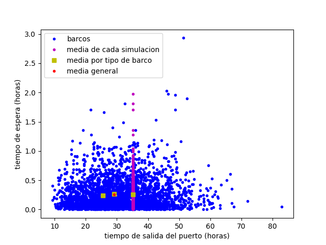
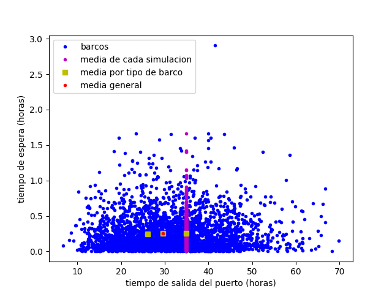
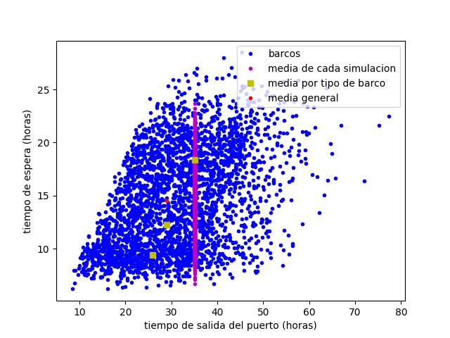
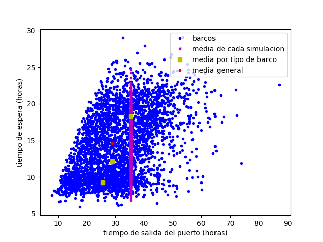

# Informe Primer Proyecto de Simulación

## Generales del Estudiante (Nombre y apellidos, grupo, etc)

- Luis Enrique Dalmau Coopat , C411

## Orden del Problema Asignado

### 2.Puerto Sobrecargado (Overloaded Harbor)

En un puerto de supertanqueros que cuenta con 3 muelles y un remolcador
para la descarga de estos barcos de manera simultánea se desea conocer el tiempo
promedio de espera de los barcos para ser cargados en el puerto.
El puerto cuenta con un bote remolcador disponible para asistir a los tan-
queros. Los tanqueros de cualquier tamaño necesitan de un remolcador para
aproximarse al muelle desde el puerto y para dejar el muelle de vuelta al puerto.
El tiempo de intervalo de arribo de cada barco distribuye mediante una fun-
ción exponencial con λ = 8 horas. Existen tres tamaños distintos de tanqueros:
pequeño, mediano y grande, la probabilidad correspondiente al tamaño de cada
tanquero se describe en la tabla siguiente. El tiempo de carga de cada tanquero
depende de su tamaño y los parámetros de distribución normal que lo representa
también se describen en la tabla siguiente.

Tamaño | Probabilidad de Arribo | Tiempo de Carga|
:----- | :------------------    | :------------  |
Pequeño | 0.25 | µ = 9, σ^2 = 1
Mediano | 0.25 | µ = 12, σ^2 = 2
Grande | 0.5 | µ = 18, σ^2 = 3

De manera general, cuando un tanquero llega al puerto, espera en una cola
(virtual) hasta que exista un muelle vacı́o y que un remolcador esté disponible
para atenderle. Cuando el remolcador está disponible lo asiste para que pueda
comenzar su carga, este proceso demora un tiempo que distribuye exponencial
con λ = 2 horas. El proceso de carga comienza inmediatamente después de que
el barco llega al muelle. Una vez terminado este proceso es necesaria la asistencia
del remolcador (esperando hasta que esté disponible) para llevarlo de vuelta al
puerto, el tiempo de esta operación distribuye de manera exponencial con λ = 1
hora. El traslado entre el puerto y un muelle por el remolcador sin tanquero
distribuye exponencial con λ = 15 minutos.
Cuando el remolcador termina la operación de aproximar un tanquero al
muelle, entonces lleva al puerto al primer barco que esperaba por salir, en caso de
que no exista barco por salir y algún muelle esté vacı́o, entonces el remolcador se
dirige hacia el puerto para llevar al primer barco en espera hacia el muelle vacı́o;
en caso de que no espere ningún barco, entonces el remolcador esperará por
2algún barco en un muelle para llevarlo al puerto. Cuando el remolcador termina
la operación de llevar algún barco al puerto, este inmediatamente lleva al primer
barco esperando hacia el muelle vacı́o. En caso de que no haya barcos en los
muelles, ni barcos en espera para ir al muelle, entonces el remolcador se queda
en el puerto esperando por algún barco para llevar a un muelle.
Simule completamente el funcionamiento del puerto. Determine el tiempo
promedio de espera en los muelles.

## Principales Ideas seguidas para la solución del problema

Utilicé la idea de un modelo de un solo servidor adaptado al problema en cuestión. Muchas de la variables propuestas en el modelo de un solo servidor se toman implicitamente como variables del problema.
El manejo de dichas variables se hace de forma interna de la misma forma que el modelo de un solo servidor.

El tiempo de espera en los muelles lo tomaremos como el tiempo en que el barco o tanquero está sin hacer nada esperando al remolcador para que lo recoja.

Lo tomo así puesto que el tiempo de espera desde que arriba al muelle hasta que sale está condicionado por el tiempo de carga de cada tipo de barco así que no aporta mucho escogerlo desde que entra al muelle. Pero, independientemente del tipo de barco que sea, si nos conviene escoger el tiempo de espera a partir de que el barco termina de cargarse en el muelle, puesto que podemos centrarnos en determinar el tiempo medio de espera de cualquier tipo de barco y si es mejorable o no agregando más remolcadores o construyendo más muelles(o demoliendo algun muelle o deshaciendonos de algun remolcador, nadie sabe ).

*** Es importante aclarar que ambas vias las puede ver en este informe

*En la implementación de la resolución del problema tenemos unas variables globales TUG_AMOUNT , DOCK_AMOUNT y TIME_LIMIT para poder simular a conveniencia diversos escenarios con respecto a estas variables.*

## Modelo de Simulación de Eventos Discretos desarrollado para resolver el problema

Primero se debe determinar el tiempo de espera promedio en los muelles. Para ello se configuro una clase Ship que representa el barco que se va a cargar en el puerto. Dicha clase tiene varios campos que indican el tiempo en que el barco pasa cada una de las etapas desde que llega al puerto hasta que se va del mismo.

Para nuestro problema en cuestión solo necesitamos utilizar 2 de estos campos. El tiempo en que llega al muelle y el tiempo en que se va de este.

Dichos campos forman parte de la clase Ship y son las siguientes:

* tow_to port_time: Tiempo en que el barco se fue del muelle para salir al puerto.

* end_loading_time: Tiempo en que el barco termina de cargarse en el muelle.

* (2da via) start_loading_time: Tiempo en que el barco empieza a cargarse en el muelle(En otras palabras en cuanto llega al muelle).

*La Clase Ship posee otras variables para poder evaluar otros tiempos objetivos como fuese el tiempo total que se demora un barco desde que llega hasta que sale del puerto o el tiempo que demora un barco en un muelle luego de completar su carga*

Para la completitud de la simulacion tambien se implementaron los scripts :

* dock.py

    - Contiene las clases :

        *  Dock (Clase que simula a un muelle y contiene campos y métodos para saber el estado del mismo dado este problema, al igual que un identificador prefijado por quien lo use)

* tug.py

    - Contiene las clases :

        * Tug (Clase que simula a un remolcador y contiene campos y métodos para saber el estado del mismo dado este problema, al igual que un identificador prefijado por quien lo use)

* port.py

    - Contiene las clases :

        * Port (Clase que simula todo el puerto. En ella se tiene la lista de muelles y la lista de remolcadores al igual que el tiempo y otras variables para llevar el estado actual del puerto, como lo son la lista de muelles que terminaron de cargar a los barcos y la lista de barcos que esperan por ser atendidos, entre otros)

* events.py

    - Contiene las clases

        * Event(como clase abstracta de la que heredan todos los eventos y que basicamente se compara con otros eventos utilizando su campo tiempo)

        * Ship_Arrival_Event (Evento del arribo de un barco. El puerto inicializa con un evento de este tipo. Al procesarse se crea le hace push a un evento de tipo Tow_to_Dock si las condiciones lo permiten y ademas tambien le hace push a un evento de su mismo tipo si el tiempo en el que debe llegar no excede el tiempo limite de trabajo del puerto )
         
        * Tow_To_Dock_Event(Evento de traslado que setea las variables del muelle al que se esta dirigiendo y ademas pushea 2 eventos uno para el muelle para empezar a cargar el barco y otro para el remolcador para que revise si hay algun barco que ya haya terminado de cargarse )

        * Tow_To_Port_Event( Evento de traslado que setea las variables del barco que se va y revisa si se puede llevar algun otro barco de la cola para ser atendidos a uno de los muelles)

        * Start_Loading_Ship_Event (Evento de muelles que inicia el proceso de carga de un barco en dependencia de su tamaño)

        * End_Loading_Ship_Event(Evento de muelle que avisa y setea sus variables para establecer que termino de cargar su barco designado y que esta disponible para ser recogido su barco)

        * Check_Finished_Ship_Event (Evento de remolcador que revisa por los muelles si algun barco terminó de cargar. En caso de que todos los muelles tengan barcos cargandose entonces espera, si hay algun muelle libre entonces aprovecha para ir a recoger a alguno de los barcos en cola en caso de que hayan barcos en la cola. En caso de que no hayan barcos en la cola pero si hayan muelles cargando espera en el muelle y si no hay barcos cargandose en el muelle ni esperando a ser recogidos en los muelles(es decir que los muelles estan vacios) y no hay barcos en cola para ser atendidos. El remolcador espera en el puerto)

        * Wait_Ship_Arrival_Event(Evento de remolcador que es necesario para simular el traslado del remolcador de los muelles hacia el puerto y setearlo como que el remolcador esta desocupado una vez se maneje este evento)

* heap.py

    - Contiene las clases:

        * Heap (heap clásico para llevar siempre el orden de los eventos bien)

* random_vars.py
    - Contiene los métodos:

        * U

        * exponential_random_variable

        * normal_random_variable (Utilizando la transformada de Box-Muller para pseudo-generar una variable aleatoria normal con los valores de sigma y mu correspondientes)

* problem_random_vars.py

    - Contiene los métodos:

        * ship_arrival( Variable aleatoria para el tiempo de arribo)

        * ship_type ( Variable aleatoria para el tipo de barco que arriba)

        * Small_Load_Time (Variable aleatoria para el tiempo que demora en cargarse un barco pequeño)

        * Medium_Load_Time (Variable aleatoria para el tiempo que demora en cargarse un barco mediano)

        * Large_Load_Time( Variable aleatoria para el tiempo que demora en cargarse un barco grande)

        * tow_to_port ( variable aleatoria para el tiempo que demora el remolcador en trasladar hacia el puerto)

        * tow_to_dock(variable aleatoria para el tiempo que demora el remolcador en trasladar hacia el muelle correspondiente)

        * free_tug_movement( Variable aleatoria para el tiempo que demora el remolcador en moverse libremente entre el muelle y el puerto )

## Consideraciones obtenidas a partir de la ejecución de las simulaciones del problema

### 1ra vía

Se simuló 1000 veces el puerto con tiempo limite de 24 horas, reseteandolo cada vez, y la media obtenida de todas las medias de cada una de las simulaciones da un aproximado de 20 minutos de espera.

Este resultado se da con un solo remolcador y 3 muelles el cual podemos evidenciar en este gráfico :

Si aumentamos el número de remolcadores para igualar la cantidad de muelles, se nos reduce un poco el tiempo de espera a un aproximado de 15 minutos. Además de que se reduce el máximo tiempo de espera considerablemente como se ve en el siguiente gráfico:

Probé un caso más con este concepto, aumento la cantidad de remolcadores al doble de la cantidad de muelles y el resultado no muestra grandes cambios.
Se mantiene el tiempo de espera en un aproximado de 15 minutos:

### 2da vía
Al igual que en la primera vía se ajustaron de igual manera los parámetros(cambiandose end_loading_time por start_loading_time en el script port.py ), obteniéndose las siguientes gráficas y resultados.

En la gráfica número 1 nos da como resultado que la media de tiempo esperado es de aproximadamente unas 14 horas. Tambien podemos apreciar como la media de tiempo por tipo de barco se encasilla bastante en su tiempo de carga.

Igualando la cantidad de remolcadores a la cantidad de muelles obtenemos la siguiente gráfica en la que podemos apreciar que el tiempo de espera promedio se mantiene en el mismo valor y sin haber mucho cambio con respecto a la modificación del número de remolcadores:

Para la última comparativa, duplicamos la cantidad de remolcadores para determinar si afecta de alguna manera los resultados. Pero como pueden apreciar, en nuestra última gráfica no se aprecian cambios significativos

Es por esta razón que me decanto por la primera vía en aras de presentar un trabajo más completo y que aporte más información acerca del problema en cuesión.
ambas versiones estarán en sus respectivas ramas, siendo la primera la que se presentará en la rama principal.

## El enlace al repositorio del proyecto en Github
https://github.com/lukedalmau/overloaded-harbor_simulation
